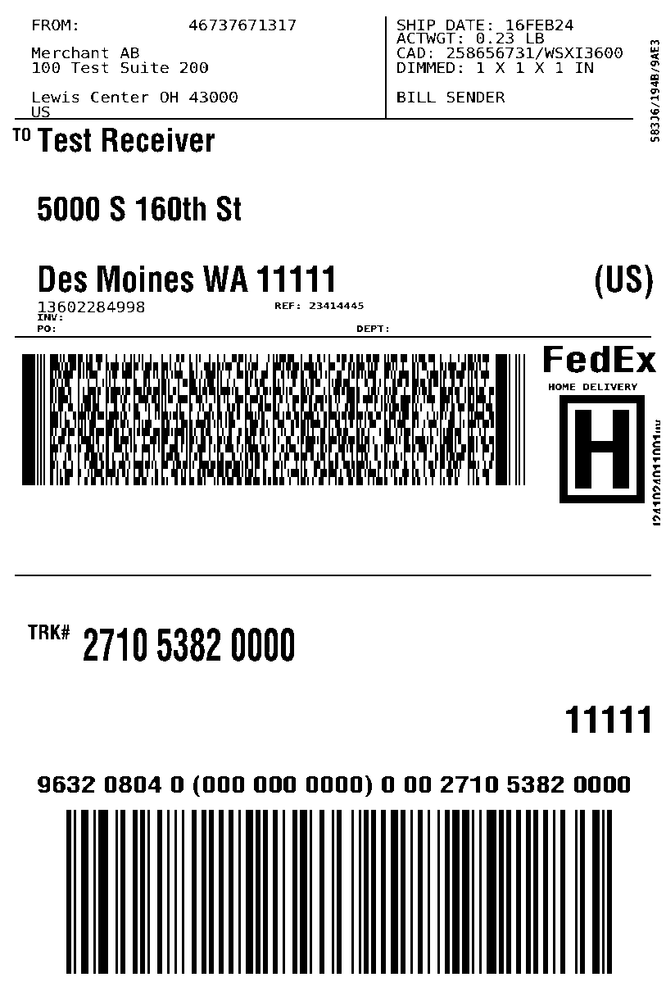

<h1>
ZPL to PNG 🦓
    <a href="https://packagist.org/packages/faerber/zpl-to-png"></a>
    <a href="https://github.com/benfaerber/zpl-to-png/actions"></a>
</h1>

<p>
<a href="phpstan.neon"></a>
<a href="LICENSE"></a>
</p>

`stripey-horse`: A knock-off Zebra renderer. A PHP client for `stripey-horse` (a ZPL to PNG renderer).



An example render of <a href="./test_data/fedex.zplbin">fedex.zplbin</a>.

## Getting Started
1. Install [`stripey-horse`](https://github.com/benfaerber/stripey-horse)
2. Locate your binary path: `which stripey-horse`


```php
use Faerber\ZplToPng\StripeyHorseConfig;
use Faerber\ZplToPng\StripeyHorseClient;

// Your binary path
$binaryPath = "/home/user/go/stripey-horse";
$client = StripeyHorseClient::buildWithBinaryPath($binaryPath);
$config = StripeyHorseConfig::builder()
    ->labelPreset("6x4")
    ->rotation(90)
    ->build();

$imageData = $client->convertZplToRawImage($zplContent, $config);

file_put_contents("my_converted_image.png", $imageData);
```

## Why?

The Labelary API is great, but it only allows 5 requests per second. This leads to constant errors and failures when generating labels at scale.

Sadly, there are no simple ways to pay for higher limits. You have to contact Labelary directly and negotiate a custom deal to self-host.

## Benefits

- **No rate limits** - render as many labels as you need
- **No external dependencies** - works completely offline
- **Cost effective** - hence "Stripey Horse" instead of "Zebra"
- **Near-perfect rendering** - comparable quality to Labelary

## Development

- **PEST Tests** - `STRIPEY_HORSE_BINARY=$(which stripey-horse) composer test`


## This uses process communication, why no FFI?
This was a tough design but I decided process communication was better
for my use case (a PHP app needing to render ZPL files to PNGs and serve them to customers).

### Reasons
- FFI would require going Go -> C -> PHP
- The C wrapper code would require manual memory management
- The `.so` would have to be installed in the PHP env instead of just installing a simple binary
- FFI would connect PHP to this program. A crash would be fatal for PHP.  
- FFI would have saved around 50ms invocation time, but for an app that takes 300ms to even render, not worth the trouble!
    - Other image generation tools like GhostScript used by Imagick use process communication also
